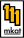

# Branding

## Name
mkat

## Slogan
every bit counts

## Colours
- FFBA00  (yellow, bold branding parts)
- Black
- White

## Logos
-  (logo and company name contained on a field of white with a black border)
-  (apple li gothic font text only logo in black on a field of yellow)
-  (world map in black on a field of yellow with our locations makred with white pins)

## Fonts
- Apple ligothic
- Helvitica and similar

## Aesthetic
Swiss Modernist. Minimalist Bauhaus. Our logo is 3 yellow ones witha thick black broder staggered to form an "M" in the 8 bit style, where the ones look like meerkats, which is the source of out name mkat for short. Therefore we value super bold thick and crisp modernist style lines. restrained yet impactful. Think **Notion** and **Browser Company of New York**.

## Locations 
- South Africa
- Hong Kong
- Germany

